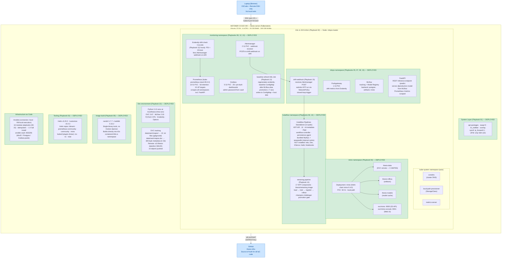
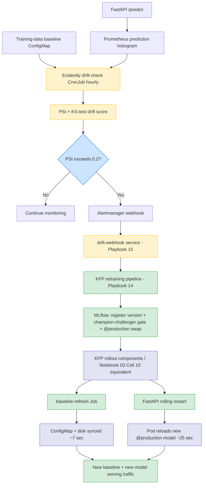

# thesis-infra

> Infrastructure-as-Code (Ansible + k3s + Kubeflow Pipelines Standalone) for a self-updating predictive maintenance MLOps platform — Master's thesis artifact.

## Project Goal

This repository contains the full infrastructure provisioning code for a **closed-loop MLOps system** that predicts the Remaining Useful Life (RUL) of turbofan engines from sensor data and **auto-recovers** when the production data distribution drifts away from the training distribution.

The thesis differentiates itself from the typical "train an LSTM on C-MAPSS, report RMSE" project by focusing on what happens **after** the model is deployed:

- continuous monitoring of input distribution and prediction quality,
- automated drift detection (PSI, KS-test) via Evidently AI,
- automatic retraining pipelines triggered when drift exceeds a threshold,
- champion-challenger evaluation before promoting a new model to production,
- end-to-end measurement of **drift-to-recovery latency**.

All components are 100% open source and run on a single Hetzner VM, making the stack reproducible inside any on-prem or air-gapped data center — relevant for defense-sector deployments where cloud is not an option.

**Dataset:** NASA C-MAPSS turbofan degradation dataset (open-access proxy for classified military engine telemetry). Data is versioned via DVC and stored in MinIO; the GitHub repository contains only the metadata pointer (`*.dvc` file).

**Deployment target:** Hetzner Cloud CCX23 (4 dedicated vCPU · 16 GB RAM · 160 GB NVMe SSD · Ubuntu 22.04 LTS · Falkenstein, Germany).

**Provisioning time:** A blank VM reaches a fully running, self-healing MLOps stack via 16 idempotent Ansible playbooks (00–15) in approximately one hour, plus a `dvc pull` to restore the dataset from MinIO. Every operational artifact — including the FastAPI, Evidently, baseline-refresh, retraining, and drift-webhook image builds — is version-controlled and reproducible; nothing is bootstrapped manually.

---

## Architecture



### Architecture Explanation

1. **Hetzner CCX23 VM**: Single-node deployment target — the entire MLOps stack runs here. Chosen for cost (~€30/month), GDPR compliance, and on-prem parity with defense-sector data centers.

2. **k3s**: Lightweight CNCF-certified Kubernetes distribution. Single binary, sub-second startup, full API compatibility. Traefik and servicelb are disabled — we use `kubectl port-forward` instead of an ingress controller.

3. **minio namespace**: S3-compatible object storage. Hosts three buckets that back DVC (data versioning), MLflow (experiment artifacts), and the FastAPI model cache. All MLOps state lives here.

4. **mlops namespace**: The core thesis layer. PostgreSQL stores metadata; MLflow tracks every training run and serves as the Model Registry; FastAPI loads the model bound to the MLflow `@production` alias and exposes `/predict`, `/healthz`, `/readyz`, `/metrics` endpoints (it falls back to a RUL=125.0 stub only until the first model is registered). The `drift-webhook` service (Playbook 15) also lives here: it receives the Alertmanager POST on drift and submits a KFP retraining run to the kubeflow namespace through a minimum-privilege NetworkPolicy — the trigger that closes the loop.

5. **kubeflow namespace**: Kubeflow Pipelines Standalone — pipeline orchestration only. Notebooks, Katib, KServe, Dex, Istio are deliberately omitted; they would consume ~4 GB extra RAM and add no thesis value. Replaced by VSCode Remote-SSH (notebooks), Optuna (HP search), and FastAPI (serving). The retraining pipeline (Playbook 14) is a 17-component KFP DAG built from the `thesis/retraining` image — load data → train LSTM → register in MLflow → champion-challenger gate → roll out FastAPI — and is invoked automatically by the drift-webhook.

6. **monitoring namespace**: Prometheus scrapes pod metrics across all namespaces (currently 15+ UP scrape targets including FastAPI via ServiceMonitor); Grafana visualizes them through 25+ pre-built Kubernetes dashboards. Evidently `drift-check` CronJob runs hourly, computing PSI and KS-test statistics from the production prediction histogram against the training baseline, pushing results to Pushgateway, and firing an Alertmanager webhook when drift exceeds the threshold (PSI ≥ 0.2). The `baseline-refresh` Kubernetes Job (Playbook 13) keeps the baseline ConfigMap synchronized with the current MLflow `@production` alias: after model promotion, it runs inference on training data, regenerates the baseline distribution, and writes to both the cluster ConfigMap and host disk in ~7 seconds. Alertmanager fires a webhook on threshold breach to the `drift-webhook` service (Playbook 15), which submits the KFP retraining pipeline (Playbook 14) — this is the fully automated closed-loop retraining cycle, validated end-to-end.

7. **Dev environment & DVC**: A Python 3.12 virtual environment with DVC, MLflow, PyTorch (CPU), Evidently, and Optuna. The C-MAPSS dataset is versioned by DVC — the 13 `.txt` files (~17 MB) live in MinIO bucket `thesis-data/dvc/`, while only a 300-byte metadata pointer (`cmapss.dvc`) is committed to Git. Reproducing the exact dataset used by any commit is a two-step recipe: `git checkout <hash>` then `dvc pull`.

8. **Image build layer**: The FastAPI image is built with `nerdctl` (containerd-native CLI) and `buildkit` (image builder), installed as single binaries from upstream GitHub releases. The image is built directly into k3s's containerd `k8s.io` namespace and consumed with `imagePullPolicy: Never` — no Docker daemon, no external registry, no `ctr import` step required. This decision saves ~150 MB RAM compared to running a parallel Docker daemon and eliminates the need for registry authentication.

9. **Ansible**: Provisioning runs on the VM itself (`connection: local`). No tooling on the laptop. Each playbook is idempotent and component-scoped, so a failure can be debugged in isolation. Secrets are stored encrypted via `ansible-vault`.

10. **Laptop**: Used only for SSH-based development through VSCode Remote-SSH and for opening port-forwarded UIs in a browser. No Docker, Python, kubectl, or Ansible is installed locally.

11. **GitHub**: Public source of truth. The encrypted vault file is committed — the AES256 ciphertext is safe to publish; only someone with the vault password can decrypt it. Raw data is excluded from Git (versioned by DVC instead).

---

## Closed-Loop Retraining (Thesis Core Contribution)



**Measured metric:** `drift-to-recovery latency` — wall-clock time from drift detection (T1) to the new model serving traffic (T4 or T5).

### Step 3 Results (measured 2026-05-24, Notebook 04 fresh run)

| Phase | Duration | Type |
|---|---|---|
| T0 → T1 (detection lag) | 2.29 min | system |
| T1 → T2 (trigger lag) | 0.00 min | manual then (now ~0 sec via drift-webhook) |
| T2 → T_RT (retraining) | 3.13 min | system |
| T_RT → T4 (pod rollout) | 0.41 min | system |
| T4 → T5 (verification loop) | 7.11 min | experiment overhead |

**Core system recovery (T4 − T1): 3.54 min** ← thesis primary result
**Total cycle (T5 − T0): 12.94 min**
**PSI improvement: 8.80 → 0.12 (72× reduction)**

Host: Hetzner CCX23 (16 GB RAM, CPU-only k3s). Model trained on FD001
(C-MAPSS engine subset 1), drift simulated by injecting 100 predictions
from FD002 (different operating regimes), recovered by sending 300
normal FD001-distributed predictions over three iterations. The
`baseline-refresh` Kubernetes Job and the FastAPI rolling restart are
chained in Notebook 03 Cell 10 — the same three-step sequence now runs
as KFP pipeline components (Playbook 14), triggered automatically by the
drift-webhook (Playbook 15).

### Statistical Validation (Notebook 04 statistical, n=3 runs)

A single measurement is scientifically insufficient, so the experiment was
repeated three times under identical conditions and aggregated:

| Metric | Result |
|---|---|
| Core system recovery (T4 − T1) | **4.07 ± 0.07 min** (95% CI: [3.99, 4.15]) |
| Retraining + rollout (T4 − T2) | 4.07 ± 0.07 min |
| Detection lag (T0 → T1) | 2.30 ± 0.01 min |
| PSI at detection (T1) | 8.80 ± 0.00 |

Low variance on the system-bound phases confirms recovery latency is
**infrastructure-bound, not stochastic** — a defensible, reproducible claim.

### Multi-Drift Severity Study (Notebook 07, 4 severities × 2 runs)

Recovery time was measured across four drift severities (mild / medium /
severe / extreme). A one-way **ANOVA** (F = 1.02, p = 0.47) fails to reject
the null hypothesis: **recovery time does not depend on drift severity**,
because recovery is dominated by fixed infrastructure cost (retraining +
rollout) rather than by the magnitude of the drift.

### Fully Automated Closed-Loop Validation (Step 5 smoke test)

The closed loop was validated end-to-end: an Evidently-detected drift fired
the Alertmanager → drift-webhook → KFP chain **automatically** (zero manual
trigger). A `drift-triggered-*` KFP run completed all 17/17 components in
~15 minutes and registered a new model version. The champion-challenger
promotion gate then correctly **rejected** the challenger under the
configured threshold (see EC#24 / EC#28), proving the safety gate protects
production from automatic promotion of an insufficiently improved model.

---

## Repository Layout

```
thesis-infra/
├── ansible.cfg                 # Ansible global config
├── requirements.yml            # Galaxy collections
├── README.md                   # This file
├── Engineering_challenges.md   # Bug + design dead-end log (EC#1-30, 29 entries)
├── LICENSE                     # MIT
│
├── inventory/
│   ├── localhost.yml           # connection: local
│   └── group_vars/
│       ├── all.yml             # shared variables
│       └── vault.yml           # AES256-encrypted secrets
│
├── playbooks/                  # 16 idempotent playbooks (00-15)
│   ├── 00-bootstrap-scripts.yml # Render observability scripts       [done]
│   ├── 01-system-prep.yml       # kernel, swap, sysctl, firewall     [done]
│   ├── 02-k3s.yml               # Kubernetes                          [done]
│   ├── 03-helm-tools.yml        # Helm, kustomize, krew               [done]
│   ├── 04-minio.yml             # S3-compatible object storage        [done]
│   ├── 05-postgres.yml          # MLflow / KFP metadata DB            [done]
│   ├── 06-kfp-standalone.yml    # Kubeflow Pipelines                  [done]
│   ├── 07-mlflow.yml            # Experiment tracking + Registry      [done]
│   ├── 08-monitoring.yml        # Prometheus + Grafana + Alertmanager [done]
│   ├── 09-fastapi.yml           # Inference REST endpoint             [done]
│   ├── 10-data-and-dev-env.yml  # Python venv + C-MAPSS + DVC         [done]
│   ├── 11-jupyter.yml           # Jupyter Lab dev server (127.0.0.1)  [done]
│   ├── 12-evidently.yml         # Drift-check CronJob (PSI + KS)      [done]
│   ├── 13-baseline-refresh.yml  # Baseline ConfigMap sync Job         [done]
│   ├── 14-retraining-pipeline.yml # KFP retraining pipeline (build+wire+upload) [done]
│   └── 15-drift-webhook.yml     # Closed-loop trigger webhook         [done]
│
├── files/                       # Static configs (Helm values, manifests, app code)
│   ├── postgres/                # PostgreSQL init SQL
│   ├── monitoring/              # kube-prometheus-stack values.yaml
│   ├── data/                    # Python requirements.txt
│   ├── jupyter/                 # jupyter_lab_config.py (Playbook 11)
│   ├── scripts/                 # Jinja2 templates for shell scripts
│   │   ├── healthcheck.sh.j2    # multi-layer system health snapshot
│   │   └── port-forward-all.sh.j2  # Multi-service tunnel manager
│   ├── fastapi/                 # FastAPI service
│   │   ├── Dockerfile           # Multi-stage build, ~200 MB
│   │   ├── app/main.py          # FastAPI app
│   │   ├── src/                 # LSTMRegressor (referenced by MLflow model)
│   │   └── k8s/                 # deployment / service / servicemonitor
│   ├── evidently/               # Drift detection container (Playbook 12)
│   │   └── app/drift_check.py   # PSI + KS-test + Pushgateway + Alertmanager
│   ├── baseline-refresh/        # Baseline sync container (Playbook 13)
│   │   ├── app/refresh.py       # Idempotent baseline regeneration
│   │   └── src/                 # Copy of files/fastapi/src (EC#17 fix)
│   ├── retraining/              # Retraining pipeline container (Playbook 14)
│   │   ├── Dockerfile
│   │   ├── app/                 # load_data · train_lstm · register_model · trigger_rollout
│   │   └── k8s/rbac.yaml
│   └── drift-webhook/           # Closed-loop trigger container (Playbook 15)
│       ├── Dockerfile
│       ├── app/main.py          # Alertmanager receiver → KFP run submit
│       └── k8s/                 # deployment · service · rbac · networkpolicy · servicemonitor
│
├── kfp/                         # Kubeflow Pipelines retraining DAG
│   ├── retraining_pipeline.py   # Pipeline definition (17 components)
│   ├── retraining_pipeline.yaml # Compiled pipeline spec
│   └── compile.sh               # Compile helper
│
├── src/                         # Shared model code (LSTMRegressor + preprocessing)
│   ├── model.py
│   └── preprocessing.py
│
├── notebooks/                   # Jupyter analysis + thesis experiments
│   ├── 01_eda.ipynb                  # Exploratory data analysis (FD001-FD004)
│   ├── 02_preprocessing.ipynb        # Sequence windowing → X_train.npy
│   ├── 03_baseline_lstm.ipynb        # LSTM training + MLflow + alias promotion
│   ├── 04_drift_simulation.ipynb     # Drift inject + retrain + measure T0-T5
│   ├── 04_statistical_validation.ipynb # Multi-run aggregation (n=3, mean ± CI)
│   ├── 05_model_comparison.ipynb     # Train + compare 7 architectures
│   ├── 06_model_comparison_visual.ipynb # Comparison charts for the thesis
│   ├── 07_multi_drift_experiments.ipynb # Recovery vs drift severity (ANOVA)
│   └── 08_multi_drift_visual.ipynb   # Multi-drift charts + dashboard
│
├── data/                        # Project data (mostly gitignored)
│   ├── raw/
│   │   ├── cmapss/              # 13 C-MAPSS .txt files (DVC tracked)
│   │   └── cmapss.dvc           # DVC metadata pointer (300 bytes, in Git)
│   ├── processed/               # Output of preprocessing (gitignored)
│   └── drift/                   # Experiment outputs (in Git)
│       ├── baseline.json             # Cluster ConfigMap mirror (single source of truth)
│       ├── recovery_metrics.json     # T0-T5 timestamps + phase durations
│       ├── recovery_timeline.png     # Gantt-style timeline plot
│       ├── notebook_04_summary.txt   # Defense-ready summary
│       ├── multi_run_summary.json    # Notebook 04 statistical aggregation (n=3)
│       ├── multi_run_defense_statement.txt # Thesis-ready statement with CIs
│       ├── multi_run_variance.png    # Per-phase variance plots
│       ├── runs/                     # Per-run artifacts of the n=3 study
│       ├── multi_drift_summary.json  # Notebook 07 severity study + ANOVA
│       └── multi_drift/              # Per-severity runs (mild/medium/severe/extreme) + plots
│
├── .dvc/                       # DVC configuration
│   ├── config                  # MinIO remote definition
│   └── .gitignore              # Cache exclusion (auto-generated)
├── .dvcignore                  # DVC scan exclusion list
│
├── scripts/                     # Helper scripts
│   ├── build-and-deploy-retraining.sh  # Build + deploy retraining image
│   ├── build_drift_baseline.py         # Generate drift baseline distribution
│   └── observability/           # Unified monitoring tools
│       ├── healthcheck.sh       # multi-layer health snapshot
│       ├── port-forward-all.sh  # multi-service tunnel manager
│       └── observability-readme.md     # Usage + recovery procedures
│
├── tests/                      # Hierarchical test suite
│   ├── README.md               # Testing strategy + design principles
│   ├── _lib.sh                 # Common helpers (pass/fail/skip + assertions)
│   ├── run-all.sh              # Orchestrator
│   ├── 01-infra/               # Pod/PVC/node-level tests
│   ├── 02-connectivity/        # DNS + cross-pod reachability
│   ├── 03-functional/          # MinIO/Postgres/MLflow/KFP/Prometheus/Grafana/...
│   ├── 04-ml/                  # ML-layer tests (training, registry, pipeline)
│   └── 99-integration/         # End-to-end scenarios
│
└── docs/                        # Operational documentation
    └── FIRST_LOOK.md            # Quick-reference for daily use
```