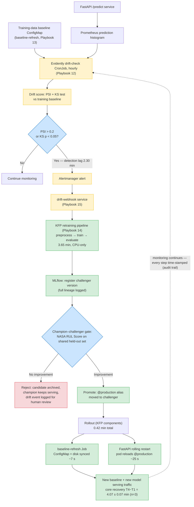
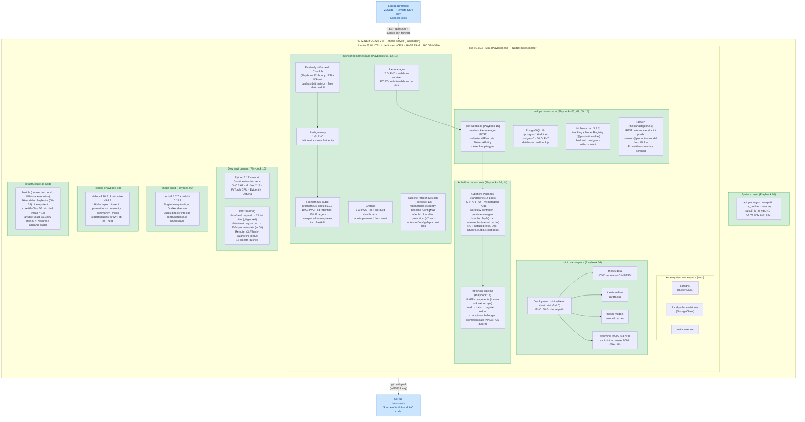

# thesis-infra

> Infrastructure-as-Code (Ansible + k3s + Kubeflow Pipelines Standalone) for a **self-updating predictive maintenance** MLOps platform — Master's thesis artifact.

**Headline result (n = 3 independent runs):** after an injected distribution shift, the closed loop detects the drift, retrains, gates and promotes a challenger, and restores the monitored production signal with a core detect-to-serve recovery of **4.07 ± 0.07 min** on a single CPU-only 16 GB VM (detection lag 2.30 ± 0.01 · retraining 3.65 ± 0.07 · rollout 0.42 min · PSI 8.80 → 0.156 ± 0.031). Once retraining is initiated, recovery latency is severity-independent (one-way ANOVA, p = 0.47).

---

## 1. Project Goal

This repository contains the full provisioning code for a **closed-loop MLOps system** that predicts the Remaining Useful Life (RUL) of turbofan engines from sensor data and **recovers automatically** when the production data distribution drifts away from the training distribution.

The thesis differentiates itself from the typical "train an LSTM on C-MAPSS, report RMSE" project by focusing on what happens **after** the model is deployed:

- continuous monitoring of the production **prediction distribution** (used as the operational proxy for sensor/input drift),
- automated drift detection (PSI + KS-test) via Evidently AI,
- automated retraining pipelines triggered when drift exceeds the threshold,
- a **champion–challenger promotion gate** (NASA RUL Score on a shared held-out set) before any model reaches production,
- end-to-end measurement of **drift-to-recovery latency**.

All components are 100 % open source and run on a single VM, making the stack reproducible inside any on-prem or air-gapped data centre — relevant for defence-sector deployments where cloud is not an option.

**Dataset:** NASA C-MAPSS turbofan degradation dataset (open-access structural proxy for military powertrain telemetry). Data is versioned via DVC and stored in MinIO; the Git repository contains only the 300-byte metadata pointer (`cmapss.dvc`).

**Deployment target:** Hetzner Cloud CCX23 — 4 dedicated vCPU · 16 GB RAM · 160 GB NVMe SSD · Ubuntu 22.04 LTS (Falkenstein, Germany).

**Provisioning:** the repository contains **sixteen idempotent Ansible playbooks (00–15)**. The **nine core playbooks (01–09)** bring up the complete MLOps platform in **≈ 50 minutes**; the remainder add the development environment, the hourly drift check, baseline synchronisation and the closed-loop webhook (full install ≈ 1 h), plus one `dvc pull` to restore the dataset. Nothing is bootstrapped manually.

---

## 2. Closed-Loop Retraining Flow



**Measured metric:** `drift-to-recovery latency` — wall-clock time from drift detection (T1) to the new model serving traffic (T4).

---

## 3. Deployment Topology 



### Design decisions behind the topology

1. **Hetzner CCX23 VM** — single-node deployment target; chosen for cost (~€30/month), GDPR compliance, and on-prem parity with defence-sector data centres.
2. **k3s** — lightweight CNCF-certified Kubernetes. Traefik and servicelb are disabled; `kubectl port-forward` replaces an ingress controller.
3. **minio namespace** — S3-compatible object storage; three buckets back DVC (data), MLflow (artifacts) and the FastAPI model cache. All MLOps state lives here.
4. **mlops namespace** — PostgreSQL 16 stores metadata; MLflow tracks every run and serves as the Model Registry; FastAPI loads the model bound to the `@production` alias and exposes `/predict`, `/healthz`, `/readyz`, `/metrics` (a RUL = 125.0 stub is served only until the first model is registered). The `drift-webhook` (Playbook 15) receives the Alertmanager POST and submits a KFP run through a minimum-privilege NetworkPolicy — the trigger that closes the loop.
5. **kubeflow namespace** — Kubeflow Pipelines Standalone, orchestration only. Istio, Dex, KServe, Katib and Notebooks are deliberately omitted (~4 GB RAM saved; replaced by Remote-SSH, Optuna and FastAPI). The retraining pipeline (Playbook 14) is an **8-component KFP DAG** (4 core + 4 extract ops) built from the `thesis/retraining` image: load data → train LSTM → register in MLflow → champion–challenger gate → roll out FastAPI.
6. **monitoring namespace** — Prometheus (15+ UP targets incl. FastAPI via ServiceMonitor), Grafana (25+ dashboards), hourly Evidently drift check (PSI + KS from the production **prediction histogram** against the training baseline → Pushgateway → Alertmanager on PSI ≥ 0.2), and the `baseline-refresh` Job that re-synchronises the baseline ConfigMap in ~7 s after every promotion.
7. **Dev environment & DVC** — Python 3.12 venv (DVC, MLflow, PyTorch CPU, Evidently, Optuna). Reproducing the exact dataset of any commit: `git checkout <hash>` → `dvc pull`.
8. **Image build layer** — `nerdctl` + `buildkit` build images straight into k3s containerd (`k8s.io` namespace), consumed with `imagePullPolicy: Never`; no Docker daemon, no external registry (~150 MB RAM saved).
9. **Ansible** — runs on the VM itself (`connection: local`), one idempotent playbook per layer; secrets in `ansible-vault` (AES256 ciphertext safe to publish).
10. **Laptop / GitHub** — laptop is SSH-only (no local tooling); GitHub is the public source of truth. Raw data is excluded from Git and versioned by DVC.

---

## 4. Data & Training Flow

```mermaid
flowchart LR
    SRC["NASA C-MAPSS FD001<br/>train / test / RUL txt files<br/>(DVC → MinIO thesis-data)"] --> L[Data Loader]
    L --> F["Constant Feature Filter<br/>drop 8 zero-variance channels<br/>(24 → 16 features)"]
    F --> R["RUL Labeler<br/>per engine unit"]
    R --> CAP["RUL Capper<br/>piecewise-linear, cap = 125"]
    CAP --> SPL["Engine-wise Splitter<br/>train / validation, no leakage"]
    SPL --> SC["Min-Max Scaler<br/>fitted on training set only"]
    SC --> WIN["Window Generator<br/>sliding windows, L = 30"]
    WIN --> TR["LSTM training<br/>2 × 64 units · dropout 0.2 · 53,569 params<br/>Adam 0.001 · MSE · 30 epochs · fixed seed"]
    TR --> REG["MLflow: log run + register model<br/>@production alias on promotion"]

    classDef step fill:#dae8fc,stroke:#6c8ebf
    class L,F,R,CAP,SPL,SC,WIN,TR step
```



Baseline result: **validation RMSE 13.54 cycles** (MAE 9.21, mean error +3.28) on 3,272 held-out windows — within the published FD001 range. A seven-architecture comparison (notebook 05) placed the GRU at 12.70 and the Transformer at 13.10 under a common benchmarking regime; the deployed LSTM's 13.22 in that study versus the 13.54 baseline run reflects run-to-run variation, not a model change.

---

## 5. Measured Results

### 5.1 Statistical validation (notebook 04_statistical, n = 3 runs) — primary result

| Metric | Result |
|---|---|
| Core system recovery (T4 − T1) | **4.07 ± 0.07 min** (95 % CI: [3.99, 4.15]) |
| Detection lag (T0 → T1) | 2.30 ± 0.01 min |
| Retraining (T2 → T_RT) | 3.65 ± 0.07 min |
| Pod rollout (T_RT → T4) | 0.42 ± 0.01 min |
| PSI at detection (T1) | 8.80 ± 0.00 |
| PSI after recovery | 0.156 ± 0.031 (≈ 58× reduction) |

Low variance on the system-bound phases confirms recovery latency is **infrastructure-bound, not stochastic**. The measured core excludes manually invoked experimental overhead; the fully automated webhook trigger exists as code (Playbooks 14–15) and its end-to-end latency remains to be timed.

### 5.2 Initial exploratory run (2026-05-24, notebook 04)

Single-run phase breakdown that shaped the instrumentation (superseded by the n = 3 figures above): detection 2.29 · retraining 3.13 · rollout 0.41 · verification overhead 7.11 min; PSI 8.80 → 0.12. Host: CCX23, CPU-only k3s. Drift injected as 100 FD002 predictions through the FD001-trained model; recovery via 300 in-distribution predictions.

### 5.3 Multi-drift severity study (notebook 07, 4 severities × 2 runs)

Two findings, kept deliberately separate:

- **Recovery cost is severity-independent once retraining is initiated.** Core recovery 3.71 / 4.04 / 3.91 / 3.96 min for mild / medium / severe / extreme; one-way ANOVA F = 1.02, **p = 0.47**. The loop performs the same fixed work regardless of drift magnitude.
- **Detection reliability is not.** Measured PSI moved *inversely* with true drift magnitude (mild 0.24, medium 0.23, severe 0.11, extreme 0.16 against out-of-range fractions of ~0 %, 3.6 %, 80.3 %, 81.1 %); at the 0.2 threshold only the medium scenario was caught in both runs. Root cause: the histogram-reconstruction path of the drift statistic (**EC#16**) compresses extreme shifts. Fixing the statistic to operate on raw prediction samples is priority future work. The 8.80 reading of the validated protocol (§5.1) and the low severity-sweep readings come from different implementations of the statistic — the detector must not be read as a severity meter.

### 5.4 Fully automated closed-loop smoke test

An Evidently-detected drift fired the Alertmanager → drift-webhook → KFP chain with **zero manual trigger**. A `drift-triggered-*` KFP run completed all **8/8 pipeline components** and registered a new model version; the champion–challenger gate then correctly **rejected** the challenger under the configured threshold (EC#24 / EC#28), demonstrating that the safety gate protects production from promotion of an insufficiently improved model.

---

## 6. Playbook Reference

| # | Playbook | Approx. time | What it provisions |
|---|---|---|---|
| 00 | bootstrap-scripts | 1 min | Observability and helper scripts used by later playbooks |
| 01 | system-prep | 5 min | OS update, packages, swap off, kernel modules, firewall |
| 02 | k3s | 5 min | Single-node Kubernetes cluster |
| 03 | helm-tools | 2 min | Helm, kustomize, kubectl plugins |
| 04 | minio | 5 min | Object storage and three buckets |
| 05 | postgres | 3 min | PostgreSQL backing MLflow and the pipeline platform |
| 06 | kfp-standalone | 10 min | Kubeflow Pipelines (standalone) |
| 07 | mlflow | 5 min | MLflow tracking and registry |
| 08 | monitoring | 8 min | Prometheus, Grafana, Alertmanager, Evidently job |
| 09 | fastapi | 5 min | Inference service build and deployment |
| 10 | data-and-dev-env | 10 min | Python venv; C-MAPSS download and DVC versioning |
| 11 | jupyter | 2 min | Jupyter Lab dev server (localhost only) |
| 12 | evidently | 1 min | Hourly drift-check CronJob (PSI + KS) |
| 13 | baseline-refresh | 1 min | Baseline ConfigMap sync Job (~7 s at run time) |
| 14 | retraining-pipeline | 3 min | Builds, wires and uploads the KFP retraining pipeline |
| 15 | drift-webhook | 1 min | Closed-loop trigger webhook (Alertmanager → KFP) |
| — | **Total (core platform, 01–09)** | **≈ 50 min** | Complete MLOps platform |

---

## 7. Reproducing the Stack

```bash
# on a clean Ubuntu 22.04 VM
git clone https://github.com/dogancantorun8/thesis-infra && cd thesis-infra

# run the playbooks in order (self-managed node: connection: local)
for pb in playbooks/*.yml; do
  ansible-playbook -i inventory/localhost.yml "$pb"
done

# restore the dataset and verify the platform
dvc pull
tests/run-all.sh        # 35+ assertions: infra → connectivity → functional → ML
```

Every playbook is idempotent — re-running is always safe and converges to the same state. A single broken layer is repaired by re-running only its playbook.

---

## 8. Repository Layout

```
thesis-infra/
├── ansible.cfg                 # Ansible global config
├── requirements.yml            # Galaxy collections
├── README.md                   # This file
├── Engineering_challenges.md   # Bug + design dead-end log (EC#1–30, 29 entries)
├── LICENSE                     # MIT
│
├── inventory/
│   ├── localhost.yml           # connection: local
│   └── group_vars/
│       ├── all.yml             # shared variables
│       └── vault.yml           # AES256-encrypted secrets
│
├── playbooks/                  # 16 idempotent playbooks (00–15) — see table above
│
├── files/                      # Static configs (Helm values, manifests, app code)
│   ├── postgres/               # PostgreSQL init SQL
│   ├── monitoring/             # kube-prometheus-stack values.yaml
│   ├── data/                   # Python requirements.txt
│   ├── jupyter/                # jupyter_lab_config.py (Playbook 11)
│   ├── scripts/                # Jinja2 templates for shell scripts
│   ├── fastapi/                # FastAPI service (Dockerfile, app, k8s manifests)
│   ├── evidently/              # Drift detection container (Playbook 12)
│   ├── baseline-refresh/       # Baseline sync container (Playbook 13)
│   ├── retraining/             # Retraining pipeline container (Playbook 14)
│   └── drift-webhook/          # Closed-loop trigger container (Playbook 15)
│
├── kfp/                        # Kubeflow Pipelines retraining DAG
│   ├── retraining_pipeline.py  # Pipeline definition (8 components: 4 core + 4 extract ops)
│   ├── retraining_pipeline.yaml# Compiled pipeline spec
│   └── compile.sh              # Compile helper
│
├── src/                        # Shared model code (LSTMRegressor + preprocessing)
│
├── notebooks/                  # Jupyter analysis + thesis experiments
│   ├── 01_eda.ipynb                     # EDA (FD001–FD004) → thesis Fig. 4.1, 4.2
│   ├── 02_preprocessing.ipynb           # Windowing → thesis Fig. 3.2 steps
│   ├── 03_baseline_lstm.ipynb           # Training + MLflow → thesis Fig. 4.3, 4.4
│   ├── 04_drift_simulation.ipynb        # Drift inject + measure → thesis Fig. 4.7
│   ├── 04_statistical_validation.ipynb  # n=3 aggregation → thesis Fig. 4.8, Table 4.5
│   ├── 05_model_comparison.ipynb        # 7 architectures → thesis Table 4.4
│   ├── 06_model_comparison_visual.ipynb # Charts → thesis Fig. 4.5, 4.6
│   ├── 07_multi_drift_experiments.ipynb # Severity + ANOVA → thesis §4.4.4
│   └── 08_multi_drift_visual.ipynb      # Charts → thesis Fig. 4.9–4.12
│
├── data/                       # Project data (mostly gitignored)
│   ├── raw/cmapss(.dvc)        # 13 C-MAPSS files, DVC-tracked
│   ├── processed/              # Preprocessing output (gitignored)
│   ├── comparison/             # 7-architecture study + plots (notebook 05/06)
│   └── drift/                  # Recovery + severity experiment outputs and plots
│
├── scripts/                    # Helper scripts + observability tools
├── tests/                      # Hierarchical suite: 01-infra · 02-connectivity ·
│                               # 03-functional · 04-ml · 99-integration (run-all.sh)
└── docs/                       # Operational documentation (FIRST_LOOK.md)
```

---
## 9. License

MIT — see `LICENSE`.

---


