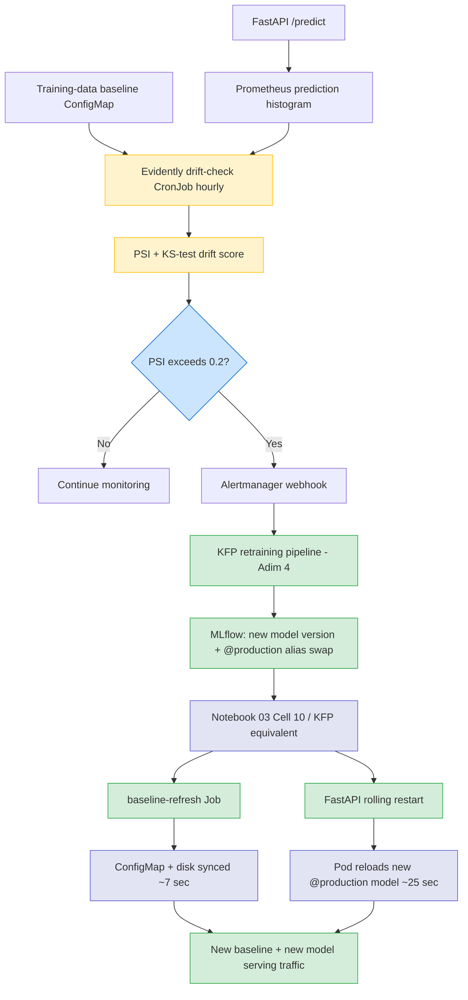

# thesis-infra

> Infrastructure-as-Code (Ansible + k3s + Kubeflow Pipelines Standalone) for a self-updating predictive maintenance MLOps platform — Master's thesis artifact.

## Project Goal

This repository contains the full infrastructure provisioning code for a **closed-loop MLOps system** that predicts the Remaining Useful Life (RUL) of turbofan engines from sensor data and **auto-recovers** when the production data distribution drifts away from the training distribution.

The thesis differentiates itself from the typical "train an LSTM on C-MAPSS, report RMSE" project by focusing on what happens **after** the model is deployed:

- continuous monitoring of input distribution and prediction quality,
- automated drift detection (PSI, KS-test) via Evidently AI,
- automatic retraining pipelines triggered when drift exceeds a threshold,
- champion-challenger evaluation before promoting a new model to production,
- end-to-end measurement of **drift-to-recovery latency**.

All components are 100% open source and run on a single Hetzner VM, making the stack reproducible inside any on-prem or air-gapped data center — relevant for defense-sector deployments where cloud is not an option.

**Dataset:** NASA C-MAPSS turbofan degradation dataset (open-access proxy for classified military engine telemetry). Data is versioned via DVC and stored in MinIO; the GitHub repository contains only the metadata pointer (`*.dvc` file).

**Deployment target:** Hetzner Cloud CCX23 (4 dedicated vCPU · 16 GB RAM · 160 GB NVMe SSD · Ubuntu 22.04 LTS · Falkenstein, Germany).

**Provisioning time:** A blank VM reaches a fully running MLOps stack via 10 idempotent Ansible playbooks in approximately 50 minutes, plus a `dvc pull` to restore the dataset from MinIO. Every operational artifact — including the FastAPI image build — is version-controlled and reproducible; nothing is bootstrapped manually.

---

## Architecture

```mermaid
flowchart TB
    subgraph VM["HETZNER CCX23 VM — thesis-server (Falkenstein)<br/>Ubuntu 22.04 · 4 vCPU · 16 GB RAM · 160 GB NVMe"]
        direction TB

        subgraph SYS["System Layer (Playbook 01) — DEPLOYED"]
            S1["apt packages · swap=0 · br_netfilter · overlay<br/>sysctl: ip_forward=1 · UFW: only SSH (22)"]
        end

        subgraph K3S["k3s v1.30.5+k3s1 (Playbook 02) — Node: mlops-master"]
            direction TB

            subgraph KS["kube-system namespace (auto)"]
                CD["coredns<br/>(cluster DNS)"]
                LP["local-path-provisioner<br/>(StorageClass)"]
                MS["metrics-server"]
            end

            subgraph MINIO["minio namespace (Playbook 04) — DEPLOYED"]
                MIO["Deployment: minio (Helm chart minio-5.4.0)<br/>PVC: 50 Gi · local-path"]
                B1["thesis-data<br/>(DVC remote — C-MAPSS)"]
                B2["thesis-mlflow<br/>(artifacts)"]
                B3["thesis-models<br/>(model cache)"]
                SVC1["svc/minio :9000 (S3 API)<br/>svc/minio-console :9001 (Web UI)"]
                MIO --> B1 & B2 & B3
                MIO --> SVC1
            end

            subgraph MLOPS["mlops namespace (Playbooks 05, 07, 09) — DEPLOYED"]
                PG["PostgreSQL<br/>postgres-0 · 10 Gi PVC<br/>databases: mlflow, kfp"]
                MLF["MLflow<br/>tracking + Model Registry<br/>backend: postgres · artifacts: minio"]
                FA["FastAPI<br/>REST inference endpoint /predict<br/>stub model: RUL=125 until trained<br/>Prometheus /metrics scraped"]
            end

            subgraph KF["kubeflow namespace (Playbook 06) — DEPLOYED"]
                KFP["Kubeflow Pipelines Standalone (14 pods)<br/>KFP API · UI · ml-metadata · Argo<br/>workflow-controller · persistence-agent<br/>bundled MySQL + seaweedfs (internal cache)<br/>NOT installed: Istio, Dex, KServe, Katib, Notebooks"]
            end

            subgraph MON["monitoring namespace (Playbooks 08, 12, 13) — DEPLOYED"]
                PROM["Prometheus (kube-prometheus-stack 85.0.3)<br/>10 Gi PVC · 5d retention · 15 UP targets<br/>scrapes all namespaces incl. FastAPI"]
                GRAF["Grafana<br/>5 Gi PVC · 25+ pre-built dashboards<br/>admin password from vault"]
                AM["Alertmanager<br/>2 Gi PVC · webhook receiver<br/>(will trigger KFP retraining on drift)"]
                EVI["Evidently drift-check CronJob<br/>(Playbook 12) hourly: PSI + KS-test<br/>fires Alertmanager webhook on drift"]
                BR["baseline-refresh K8s Job (Playbook 13)<br/>regenerates evidently-baseline ConfigMap<br/>after MLflow alias promotion (~7 sec)<br/>writes to ConfigMap + host disk"]
                PG["Pushgateway<br/>1 Gi PVC<br/>drift metrics from Evidently"]
                EVI --> PROM
                AM --> KFP
            end
        end

        subgraph DEV["Dev environment (Playbook 10) — DEPLOYED"]
            VENV["Python 3.12 venv at /root/thesis-infra/.venv<br/>DVC 3.67 · MLflow 2.18 · PyTorch CPU · Evidently · Optuna"]
            DVC["DVC tracking<br/>data/raw/cmapss/ → 13 .txt files (gitignored)<br/>data/raw/cmapss.dvc → 300-byte metadata (in Git)<br/>Remote: s3://thesis-data/dvc/ (MinIO)<br/>15 objects pushed"]
        end

        subgraph BUILD["Image build (Playbook 09) — DEPLOYED"]
            ND["nerdctl 1.7.7 + buildkit 0.15.2<br/>Single-binary tools, no Docker daemon<br/>Builds directly into k3s containerd k8s.io namespace"]
        end

        subgraph TOOLS["Tooling (Playbook 03) — DEPLOYED"]
            T1["Helm v3.20.2 · kustomize v5.4.3<br/>Helm repos: bitnami · prometheus-community · community · minio<br/>kubectl plugins (krew): ctx · ns · neat"]
        end

        subgraph IAC["Infrastructure as Code"]
            I1["Ansible (connection: local · VM-local execution)<br/>10 modular playbooks (01-10) · idempotent · ~50 min full install<br/>ansible-vault: AES256 (MinIO / Postgres / Grafana pwds)"]
        end
    end

    LAPTOP["Laptop (Bremen)<br/>VSCode + Remote-SSH only<br/>No local tools"]
    GH["GitHub<br/>thesis-infra<br/>Source of truth for all IaC code"]

    LAPTOP -- "SSH (port 22) +<br/>kubectl port-forward" --> VM
    VM -- "git push/pull<br/>(ed25519 key)" --> GH

    classDef done fill:#d4edda,stroke:#28a745,color:#155724
    classDef partial fill:#fff3cd,stroke:#ffc107,color:#856404
    classDef external fill:#cce5ff,stroke:#0066cc,color:#004085

    class SYS,MINIO,KF,MON,TOOLS,IAC,DEV,BUILD,MLOPS done
    class LAPTOP,GH external
```



### Architecture Explanation

1. **Hetzner CCX23 VM**: Single-node deployment target — the entire MLOps stack runs here. Chosen for cost (~€30/month), GDPR compliance, and on-prem parity with defense-sector data centers.

2. **k3s**: Lightweight CNCF-certified Kubernetes distribution. Single binary, sub-second startup, full API compatibility. Traefik and servicelb are disabled — we use `kubectl port-forward` instead of an ingress controller.

3. **minio namespace**: S3-compatible object storage. Hosts three buckets that back DVC (data versioning), MLflow (experiment artifacts), and the FastAPI model cache. All MLOps state lives here.

4. **mlops namespace**: The core thesis layer. PostgreSQL stores metadata; MLflow tracks every training run and serves as the Model Registry; FastAPI loads the current Production-stage model from MLflow and exposes `/predict`, `/healthz`, `/readyz`, `/metrics` endpoints. Until a real model is registered, FastAPI runs with a stub that returns RUL=125.0, allowing the full platform to be tested end-to-end.

5. **kubeflow namespace**: Kubeflow Pipelines Standalone — pipeline orchestration only. Notebooks, Katib, KServe, Dex, Istio are deliberately omitted; they would consume ~4 GB extra RAM and add no thesis value. Replaced by VSCode Remote-SSH (notebooks), Optuna (HP search), and FastAPI (serving).

6. **monitoring namespace**: Prometheus scrapes pod metrics across all namespaces (currently 15+ UP scrape targets including FastAPI via ServiceMonitor); Grafana visualizes them through 25+ pre-built Kubernetes dashboards. Evidently `drift-check` CronJob runs hourly, computing PSI and KS-test statistics from the production prediction histogram against the training baseline, pushing results to Pushgateway, and firing an Alertmanager webhook when drift exceeds the threshold (PSI ≥ 0.2). The `baseline-refresh` Kubernetes Job (Playbook 13) keeps the baseline ConfigMap synchronized with the current MLflow `@production` alias: after model promotion, it runs inference on training data, regenerates the baseline distribution, and writes to both the cluster ConfigMap and host disk in ~7 seconds. Alertmanager fires webhooks on threshold breach — in Adım 4 this becomes the trigger for the fully automated closed-loop retraining cycle.

7. **Dev environment & DVC**: A Python 3.12 virtual environment with DVC, MLflow, PyTorch (CPU), Evidently, and Optuna. The C-MAPSS dataset is versioned by DVC — the 13 `.txt` files (~17 MB) live in MinIO bucket `thesis-data/dvc/`, while only a 300-byte metadata pointer (`cmapss.dvc`) is committed to Git. Reproducing the exact dataset used by any commit is a two-step recipe: `git checkout <hash>` then `dvc pull`.

8. **Image build layer**: The FastAPI image is built with `nerdctl` (containerd-native CLI) and `buildkit` (image builder), installed as single binaries from upstream GitHub releases. The image is built directly into k3s's containerd `k8s.io` namespace and consumed with `imagePullPolicy: Never` — no Docker daemon, no external registry, no `ctr import` step required. This decision saves ~150 MB RAM compared to running a parallel Docker daemon and eliminates the need for registry authentication.

9. **Ansible**: Provisioning runs on the VM itself (`connection: local`). No tooling on the laptop. Each playbook is idempotent and component-scoped, so a failure can be debugged in isolation. Secrets are stored encrypted via `ansible-vault`.

10. **Laptop**: Used only for SSH-based development through VSCode Remote-SSH and for opening port-forwarded UIs in a browser. No Docker, Python, kubectl, or Ansible is installed locally.

11. **GitHub**: Public source of truth. The encrypted vault file is committed — the AES256 ciphertext is safe to publish; only someone with the vault password can decrypt it. Raw data is excluded from Git (versioned by DVC instead).

---

## Closed-Loop Retraining (Thesis Core Contribution)



**Measured metric:** `drift-to-recovery latency` — wall-clock time from drift detection (T1) to the new model serving traffic (T4 or T5).

### Adım 3 Results (measured 2026-05-24, Notebook 04 fresh run)

| Phase | Duration | Type |
|---|---|---|
| T0 → T1 (detection lag) | 2.29 min | system |
| T1 → T2 (trigger lag) | 0.00 min | manual (Adım 4: ~0 sec via webhook) |
| T2 → T_RT (retraining) | 3.13 min | system |
| T_RT → T4 (pod rollout) | 0.41 min | system |
| T4 → T5 (verification loop) | 7.11 min | experiment overhead |

**Core system recovery (T4 − T1): 3.54 min** ← thesis primary result
**Total cycle (T5 − T0): 12.94 min**
**PSI improvement: 8.80 → 0.12 (72× reduction)**

Host: Hetzner CCX23 (16 GB RAM, CPU-only k3s). Model trained on FD001
(C-MAPSS engine subset 1), drift simulated by injecting 100 predictions
from FD002 (different operating regimes), recovered by sending 300
normal FD001-distributed predictions over three iterations. The
`baseline-refresh` Kubernetes Job and the FastAPI rolling restart are
chained in Notebook 03 Cell 10 — the same three-step sequence will run
as KFP pipeline components in Adım 4.

---

## Repository Layout

```
thesis-infra/
├── ansible.cfg                 # Ansible global config
├── requirements.yml            # Galaxy collections
├── README.md                   # This file
├── ENGINEERING_CHALLENGES.md   # Bug + design dead-end log (EC#1-18)
├── LICENSE                     # MIT
│
├── inventory/
│   ├── localhost.yml           # connection: local
│   └── group_vars/
│       ├── all.yml             # shared variables
│       └── vault.yml           # AES256-encrypted secrets
│
├── playbooks/
│   ├── 00-bootstrap-scripts.yml # Render observability scripts       [done]
│   ├── 01-system-prep.yml       # kernel, swap, sysctl, firewall     [done]
│   ├── 02-k3s.yml               # Kubernetes                          [done]
│   ├── 03-helm-tools.yml        # Helm, kustomize, krew               [done]
│   ├── 04-minio.yml             # S3-compatible object storage        [done]
│   ├── 05-postgres.yml          # MLflow / KFP metadata DB            [done]
│   ├── 06-kfp-standalone.yml    # Kubeflow Pipelines                  [done]
│   ├── 07-mlflow.yml            # Experiment tracking + Registry      [done]
│   ├── 08-monitoring.yml        # Prometheus + Grafana + Alertmanager [done]
│   ├── 09-fastapi.yml           # Inference REST endpoint             [done]
│   ├── 10-data-and-dev-env.yml  # Python venv + C-MAPSS + DVC         [done]
│   ├── 11-jupyter.yml           # Jupyter Lab dev server (127.0.0.1)  [done]
│   ├── 12-evidently.yml         # Drift-check CronJob (PSI + KS)      [done]
│   ├── 13-baseline-refresh.yml  # Baseline ConfigMap sync Job         [done]
│   └── 14-kfp-retraining.yml    # KFP pipeline + webhook (Adim 4)     [planned]
│
├── files/                       # Static configs (Helm values, manifests, app code)
│   ├── postgres/                # PostgreSQL init SQL
│   ├── monitoring/              # kube-prometheus-stack values.yaml
│   ├── data/                    # Python requirements.txt
│   ├── scripts/                 # Jinja2 templates for shell scripts
│   │   ├── healthcheck.sh.j2    # 6-layer system health snapshot
│   │   └── port-forward-all.sh.j2  # Multi-service tunnel manager
│   ├── fastapi/                 # FastAPI service
│   │   ├── Dockerfile           # Multi-stage build, ~200 MB
│   │   ├── app/
│   │   │   ├── main.py          # FastAPI app (200 lines)
│   │   │   └── requirements.txt
│   │   ├── src/                 # LSTMRegressor (referenced by MLflow model)
│   │   │   ├── model.py
│   │   │   └── preprocessing.py
│   │   └── k8s/
│   │       ├── deployment.yaml
│   │       ├── service.yaml
│   │       └── servicemonitor.yaml
│   ├── evidently/               # Drift detection container (Playbook 12)
│   │   ├── Dockerfile
│   │   └── app/
│   │       ├── drift_check.py   # PSI + KS-test + Pushgateway + Alertmanager
│   │       └── requirements.txt
│   └── baseline-refresh/        # Baseline sync container (Playbook 13)
│       ├── Dockerfile           # Python 3.12 + kubectl + boto3 + torch + mlflow
│       ├── app/
│       │   ├── refresh.py       # Idempotent baseline regeneration
│       │   └── requirements.txt
│       └── src/                 # Copy of files/fastapi/src (EC#17 fix)
│
├── notebooks/                   # Jupyter analysis + thesis experiments
│   ├── 01_eda_cmapss.ipynb      # Exploratory data analysis (FD001-FD004)
│   ├── 02_preprocessing.ipynb   # Sequence windowing → X_train.npy
│   ├── 03_baseline_lstm.ipynb   # LSTM training + MLflow + alias promotion
│   │                            # + Cell 10 post-promotion sync (3 steps)
│   └── 04_drift_simulation.ipynb # Drift inject + retrain + measure T0-T5
│
├── data/                        # Project data (mostly gitignored)
│   ├── raw/
│   │   ├── cmapss/              # 13 C-MAPSS .txt files (DVC tracked)
│   │   └── cmapss.dvc           # DVC metadata pointer (300 bytes, in Git)
│   ├── processed/               # Output of preprocessing (gitignored)
│   │   ├── X_train.npy          # Training windows (also mirrored to MinIO)
│   │   └── X_val.npy
│   └── drift/                   # Notebook 04 experiment outputs (in Git)
│       ├── baseline.json        # Cluster ConfigMap mirror (single source of truth)
│       ├── recovery_metrics.json     # T0-T5 timestamps + phase durations
│       ├── recovery_timeline.png     # Gantt-style timeline plot
│       └── notebook_04_summary.txt   # Defense-ready summary
│
├── .dvc/                       # DVC configuration
│   ├── config                  # MinIO remote definition
│   └── .gitignore              # Cache exclusion (auto-generated)
├── .dvcignore                  # DVC scan exclusion list
│
├── scripts/                     # Helper bash scripts
│   └── observability/           # Unified monitoring tools
│       ├── healthcheck.sh       # 6-layer health snapshot (infra/storage/
│       │                        # resources/ports/services/model)
│       ├── port-forward-all.sh  # 9-service tunnel manager
│       └── README.md            # Usage + recovery procedures
│
├── tests/                      # Hierarchical test suite (35+ assertions)
│   ├── README.md               # Testing strategy + design principles
│   ├── _lib.sh                 # Common helpers (pass/fail/skip + assertions)
│   ├── run-all.sh              # Orchestrator
│   ├── 01-infra/               # Pod/PVC/node-level tests
│   ├── 02-connectivity/        # DNS + cross-pod reachability
│   ├── 03-functional/          # MinIO/Postgres/MLflow/KFP/Prometheus/
│   │                           # Grafana/Alertmanager/DVC/FastAPI tests
│   └── 99-integration/         # End-to-end scenarios (planned)
│
└── docs/                        # Operational documentation
    └── FIRST_LOOK.md            # Quick-reference for daily use
```

---

## Engineering Challenges

A growing log of non-trivial bugs and design dead-ends encountered while
building this system — see **[ENGINEERING_CHALLENGES.md](./ENGINEERING_CHALLENGES.md)**.

Currently 18 entries (EC#1–EC#18). EC#1–13 are documented in their
resolving commit messages (`git log --grep="EC#"`); EC#14–18 are
documented in detail in `ENGINEERING_CHALLENGES.md` with symptom, root
cause, fix, and design notes.

The documentation pattern itself is a thesis contribution — "what could
go wrong, and how was it discovered" is as important as the architecture.

---

## License

MIT — see `LICENSE`. This work is part of an academic Master's thesis.
